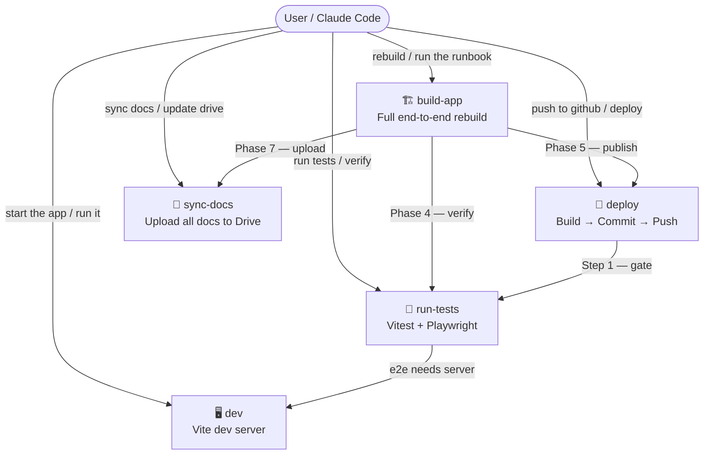
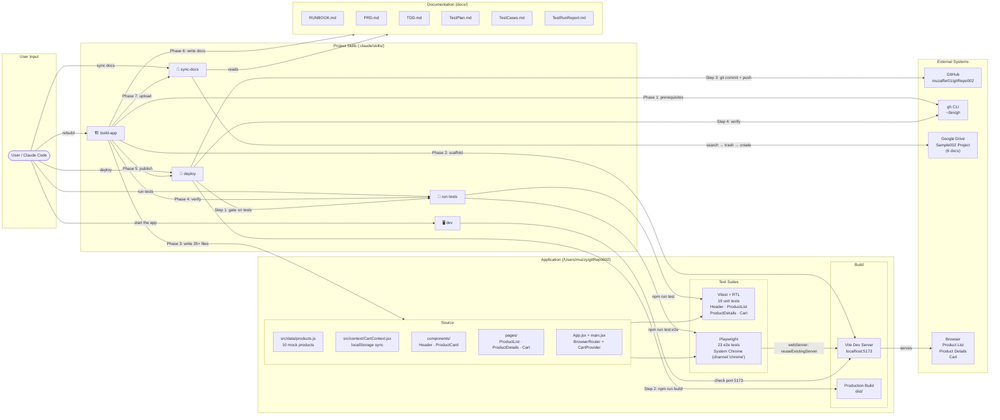
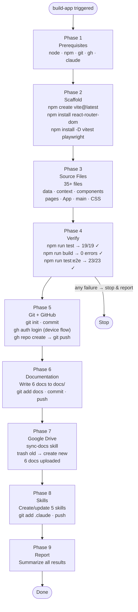
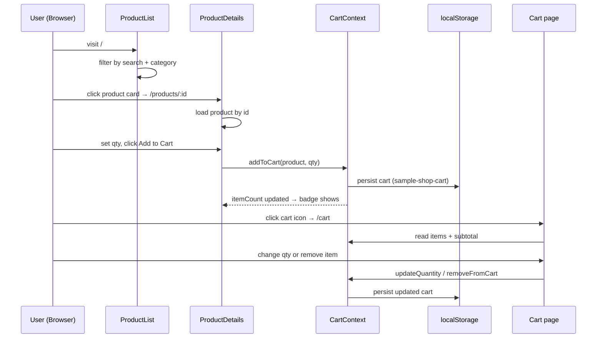

# SampleShop — Skills Flow Diagram

> How the 5 project skills interact with each other, the app, and external systems.

---

## High-Level Skills Overview

---

## Detailed Skill Flow

---

## Build-App Phase Breakdown

---

## Data Flow: User Action → App State → Persistence

---

_Last updated: 2026-08-17_
